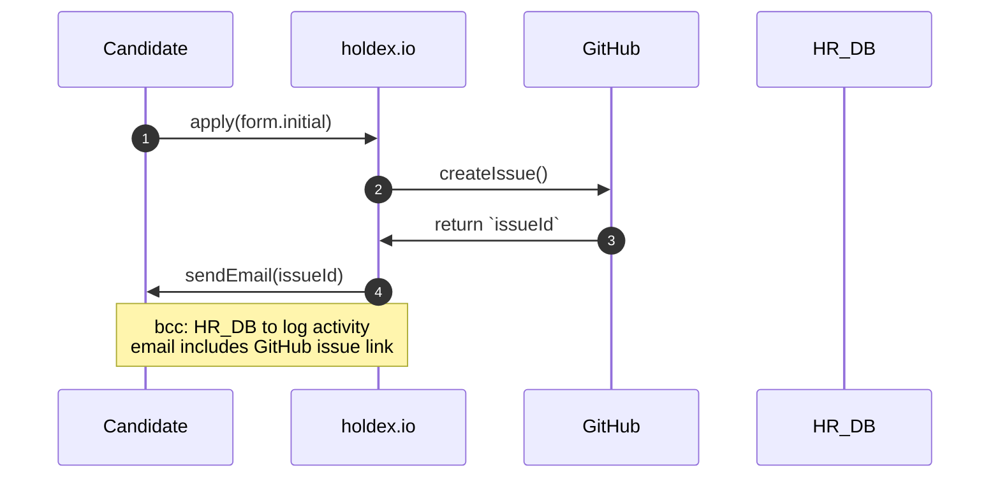

This is a folder to store message templates used in HR communication.

# Onboarding flow

```mermaid
sequenceDiagram
    autonumber

    participant c as Candidate
    participant h as holdex.io
    participant g as GitHub
    participant db as HR_DB

    c->>h: apply(form.initial)
    h->>g: createIssue()
    g->>h: return `issueId`
    h->>c: sendEmail(issueId)
    Note over h,c: bcc: HR_DB to log activity<br/> email includes GitHub issue link
```
